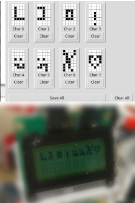

# LCD_Char_Draw

Simple LCD screen script for drawing 5x8 custom characters

They are saved as a binary list to copy or to load directly into to the display script 

Example script uses [Adafruit CharLCD](https://github.com/adafruit/Adafruit_Python_CharLCD)
